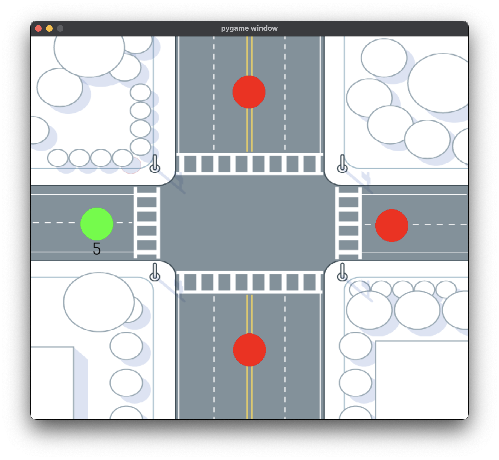

# Automatic Traffic Light Controller System
A system that controls the traffic according to traffic volume

# Setup
- Install the required dependencies: `pip3 install -r requirements.txt`

# Run
- Run the main script: `python3 main.py`

# Screenshots

# License
This project is licensed under the GPL-3.0 license. Read more about it [here](LICENSE). If you want to do anything with this project which goes against the license, please contact me for permission.